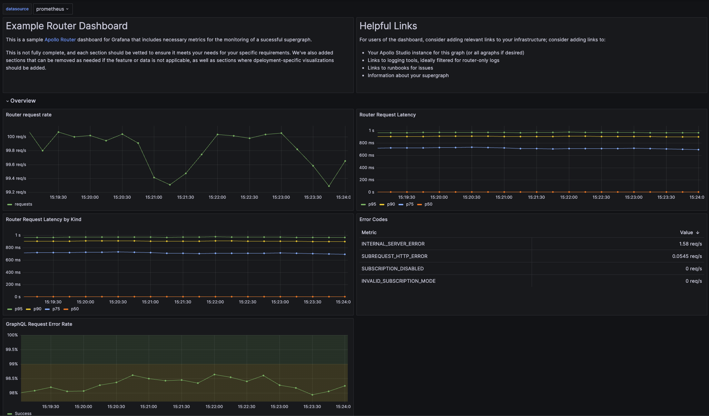

# Apollo Router Grafana Dashboard Example



This repository contains a [JSON file](./example-dashboard.json) containing an example [Grafana](https://grafana.com/oss/grafana/) dashboard for reference or use with the Apollo Router.

**The code in this repository is experimental and has been provided for reference purposes only. Community feedback is welcome but this project may not be supported in the same way that repositories in the official [Apollo GraphQL GitHub organization](https://github.com/apollographql) are. If you need help you can file an issue on this repository, [contact Apollo](https://www.apollographql.com/contact-sales) to talk to an expert, or create a ticket directly in Apollo Studio.**

## Installation

This repository contains the JSON needed to [import as a new dashboard](https://grafana.com/docs/grafana/latest/dashboards/build-dashboards/import-dashboards/) in your Grafana instance. 

This dashboard requires: 
- Grafana
- A Prometheus datasource
- Prometheus gathering metrics from the Apollo Router running v2.0 or higher

This dashboard also leverages the following telemetry configuration for the router:

```yaml
telemetry:
  instrumentation:
    instruments:
      router:
        http.server.request.duration:
          attributes:
            http.response.status_code: true
            graphql.errors:
              on_graphql_error: true
      subgraph:
        http.client.request.duration:
          attributes:
            subgraph.name: true
            http.response.status_code:
              subgraph_response_status: code
            graphql.errors:
              subgraph_on_graphql_error: true
        http.client.request.body.size:
          attributes:
            subgraph.name: true
      connector:
        http.client.request.body.size: true
        http.client.request.duration: true
        http.client.response.body.size: true
```

## Usage

Once imported, select your datasource in the top variable section and the dashboard should populate so long as you use the standard metric values. 

## Known Limitations

The template does not include any panels for resource views; this data is often bespoke to the environments in which the router is run, therefore it is easier to add your own panels from the correct datasources. 

There are sections for resources, however, to be able to input the necessary panels. 
